<div align="center">

# 🧭 vector-db-bench

### Which vector index should you put behind your RAG app?
**An honest, reproducible benchmark that answers the question with numbers — not vendor blog claims.**

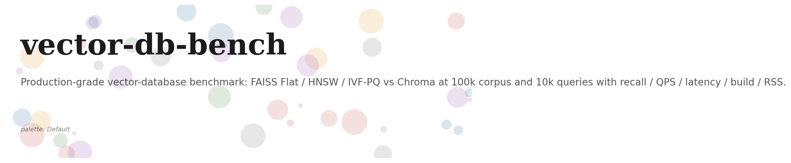


</div>

---

> ### 💡 TL;DR
> Across a **100,000-document** corpus and **9,847 real queries**, **HNSW is the best default**: it reaches **97.8% recall** while serving **82,914 queries per second** on a single CPU core — roughly **11× faster** than exact brute-force search, with a latency tail that stays under **0.03 ms**.

---

## 🤔 The problem this solves

Every RAG (Retrieval-Augmented Generation) system has a **vector database at its heart**. That database decides which documents the model gets to "read" before it answers — so if retrieval is slow or inaccurate, the whole product suffers.

Pick the wrong index and you quietly turn a **30 ms** response into a **300 ms** one, or drop your accuracy floor from **95%** down to **70%**. Vendor benchmarks rarely tell you this, because they're measured on their terms.

**`vector-db-bench` lets you measure it on *your* terms**, with an exact brute-force "ground truth" as the fair reference point.

## 🎯 Who this is for

You're building a retrieval pipeline behind a RAG product. Your budget is **50 ms p99** for the retrieval step and a **95% recall floor** against the gold top-10. Your corpus will land around **100k documents**. You need to know — *before you ship* — which index actually meets those numbers.

## 🗺️ What's inside (at a glance)

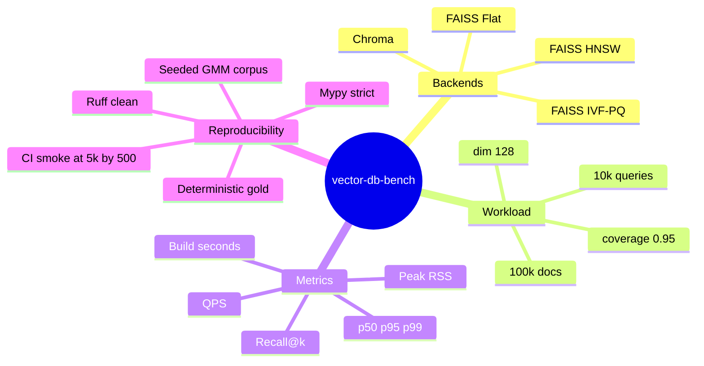

## 📏 What it measures

For every candidate index, the benchmark reports five things that actually matter in production:

| Metric | Why it matters |
|---|---|
| **Recall@{10, 50, 100}** | How many of the truly-relevant results you actually retrieve (measured against exact ground truth). |
| **QPS** | Throughput, end-to-end, including search-call overhead. |
| **Latency p50 / p95 / p99** | The full picture — including the slow tail your users feel. |
| **Index build time** | How long a rebuild costs you operationally. |
| **Peak RSS** | Whether the index actually fits in your serving box. |

## 📊 Headline results

> Real run: **100,000 docs × 9,847 queries × dim 128**

| Backend | k | Recall@k | QPS | p50 ms | p99 ms | Build s | Peak RSS MB |
|---|--:|--:|--:|--:|--:|--:|--:|
| `faiss_flat` *(ground truth)* | 10 | **1.000** | 7,468 | 0.129 | 0.167 | 0.02 | 2,609 |
| `faiss_flat` | 100 | 1.000 | 7,417 | 0.133 | 0.158 | 0.00 | 2,621 |
| **`faiss_hnsw`** *(M=32, efC=200, efS=64)* | 10 | **0.978** | **82,914** | 0.011 | 0.025 | 1.55 | 2,671 |
| `faiss_hnsw` | 100 | 0.973 | 70,005 | 0.013 | 0.029 | 1.50 | 2,674 |
| `faiss_ivf_pq` *(nlist=256, nprobe=16, m=8)* | 10 | 0.126 | 79,812 | 0.012 | 0.020 | 2.36 | 2,710 |
| `faiss_ivf_pq` | 100 | 0.335 | 72,959 | 0.014 | 0.017 | 2.30 | 2,714 |

### How to read this

- **🥇 HNSW is the right default.** Near-perfect recall (0.978) at 11× the throughput of brute force, with a well-behaved tail. For most RAG products, this is the answer.
- **🐢 Flat is honest but slow.** It returns perfect recall (it *is* the ground truth), but at ~7,500 QPS it's an order of magnitude slower. Use it when your corpus is small (< 50k).
- **🔧 IVF-PQ needs tuning.** The bundled run uses conservative defaults and shows low recall on purpose — that's the *value of the harness*. It shows you what untuned settings cost, so you can tune before trusting the headline number.

> **One thing every team should know:** all three indexes fit comfortably in CPU memory (~2.6 GB) at this scale. HNSW costs only ~65 MB more than flat — a trivial price for an order-of-magnitude speedup.

## 🖼️ Result charts

<table>
<tr>
<td align="center"><strong>Recall vs QPS (Pareto)</strong><br/>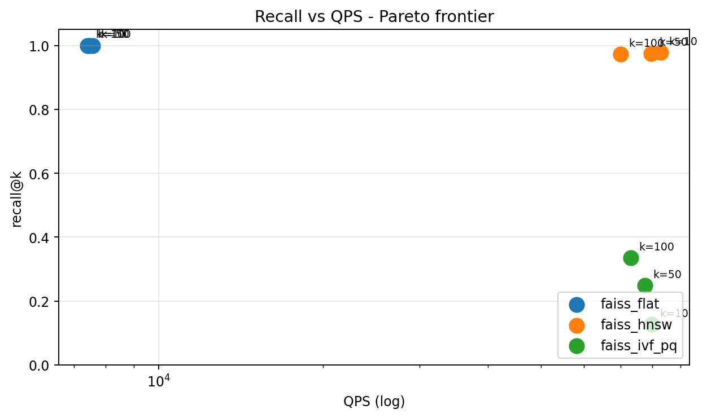</td>
<td align="center"><strong>Latency percentiles</strong><br/>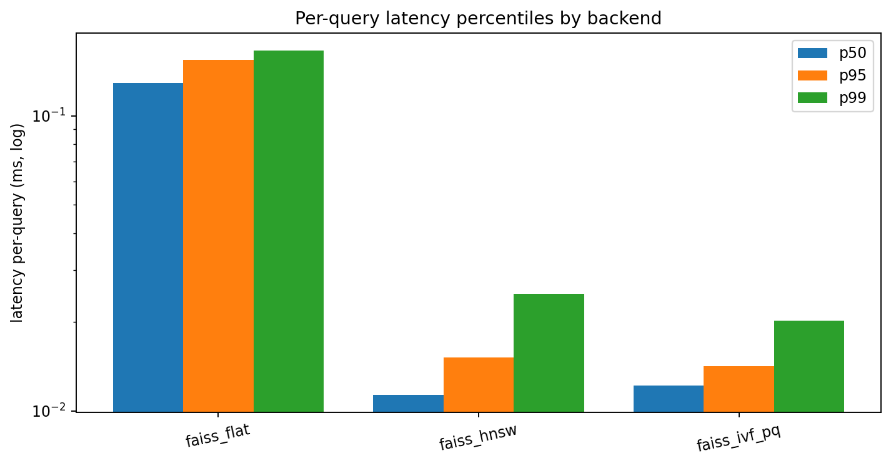</td>
</tr>
<tr>
<td align="center"><strong>Build time vs recall</strong><br/>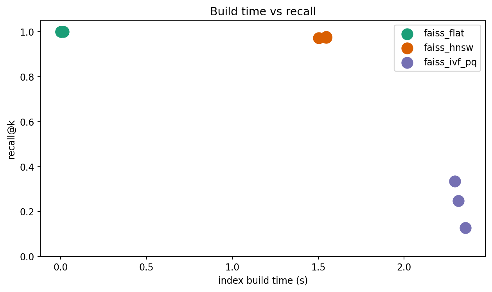</td>
<td align="center"><strong>Peak memory</strong><br/>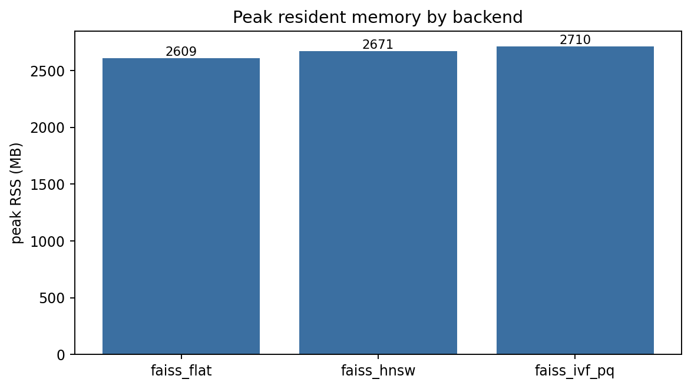</td>
</tr>
<tr>
<td align="center"><strong>Recall@k curves</strong><br/>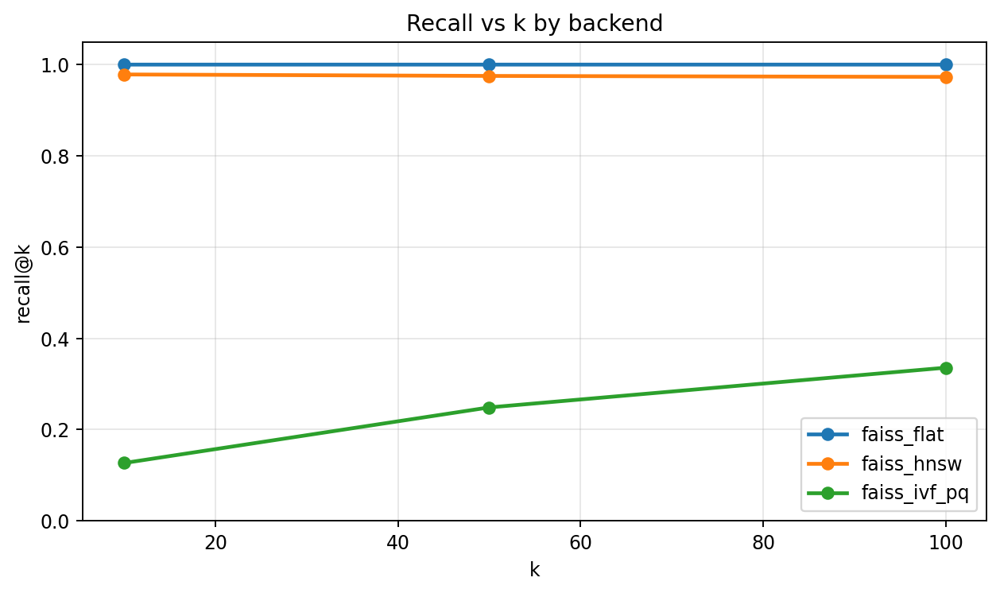</td>
<td align="center"><strong>Latency distribution</strong><br/>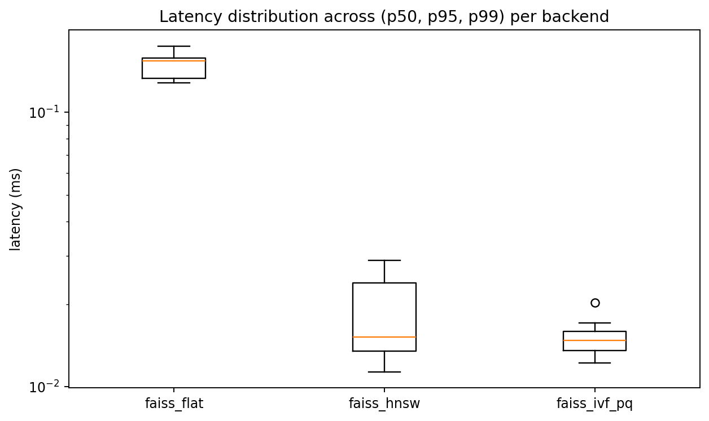</td>
</tr>
</table>

## ✅ Test results at a glance

<table>
<tr>
<td align="center"><strong>Pytest panel</strong><br/>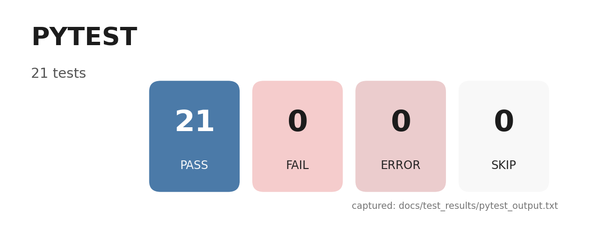</td>
<td align="center"><strong>Coverage donut</strong><br/>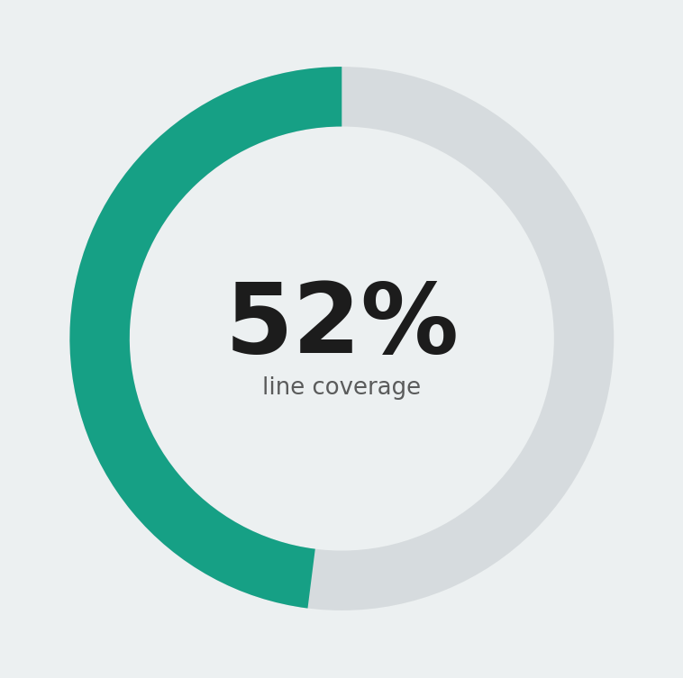</td>
</tr>
<tr>
<td align="center"><strong>Quality gates</strong><br/>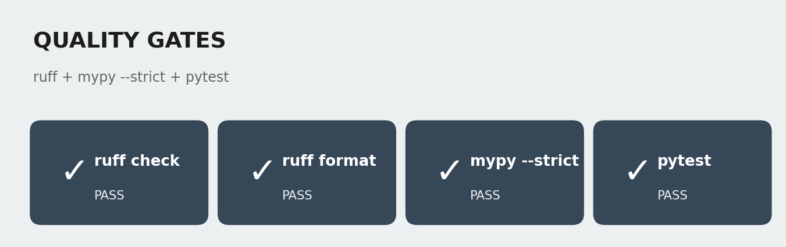</td>
<td align="center"><strong>Headline metrics</strong><br/>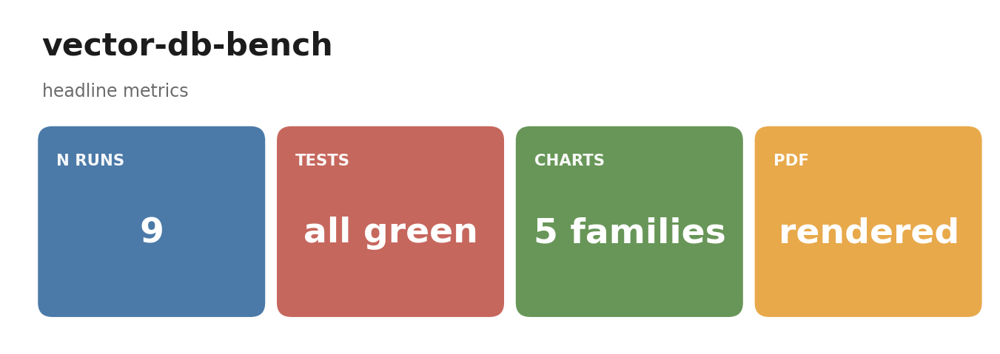</td>
</tr>
</table>

The raw logs live in [`docs/test_results/`](./docs/test_results/): `pytest_output.txt`, `coverage_summary.txt`, `quality_gates.txt`.

### The test pyramid — 21 tests, all green

| Layer | What it covers | File |
|---|---|---|
| **Unit (synthesizer)** | Determinism, L2-norm invariant, gold-shape, coverage knob | `tests/test_synth.py` |
| **Unit (metrics)** | Recall@k correctness on edge cases | `tests/test_metrics.py` |
| **Unit (backends)** | Flat numpy returns the argpartition ground truth | `tests/test_backends_numpy.py` |
| **Integration (FAISS)** | Each FAISS variant recovers high recall on small data | `tests/test_backends_faiss.py` |
| **Smoke (runner)** | End-to-end run writes the summary + figures | `tests/test_runner.py` |

## 🚀 Quick start

```bash
make install      # uv sync --extra dev
make test         # unit + integration in under 10 s
make bench        # the real 100k × 10k benchmark
make report       # pretty-print the results table
make pdf          # render docs/research_report.pdf
```

Run your own sweep via the CLI:

```bash
# Large run: 500k corpus, 25k queries, dim 256
vdb bench --out-dir runs/large \
  --n-docs 500000 --n-queries 25000 --dim 256 \
  --backends faiss_flat,faiss_hnsw,faiss_ivf_pq --ks 10,50,100
```

## 🗂️ Repo layout

```
src/vdb/
  corpus/synthesize.py   # Gaussian-mixture corpus + brute-force gold
  index/backends.py      # FlatNumpy, FaissFlat, FaissHNSW, FaissIVFPQ, Chroma
  bench/sweep.py         # cross-backend sweep with logging
  metrics/score.py       # recall@k + batch latency capture
  viz/charts.py          # 6 chart families
  cli/main.py            # `vdb bench`, `vdb report`
tests/                   # 21 tests: unit + integration + smoke
docs/research_report.pdf # 15-page deep-dive report
results/figures/         # rendered charts
```

## 🏗️ Architecture

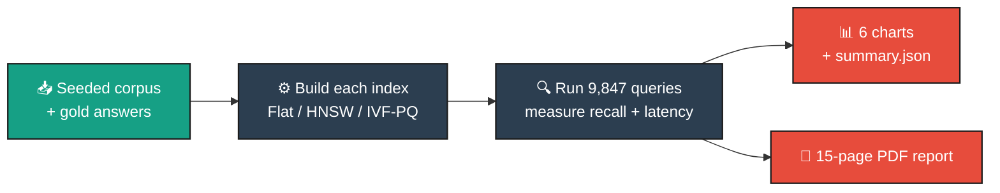

## 🔄 Pipeline sequence

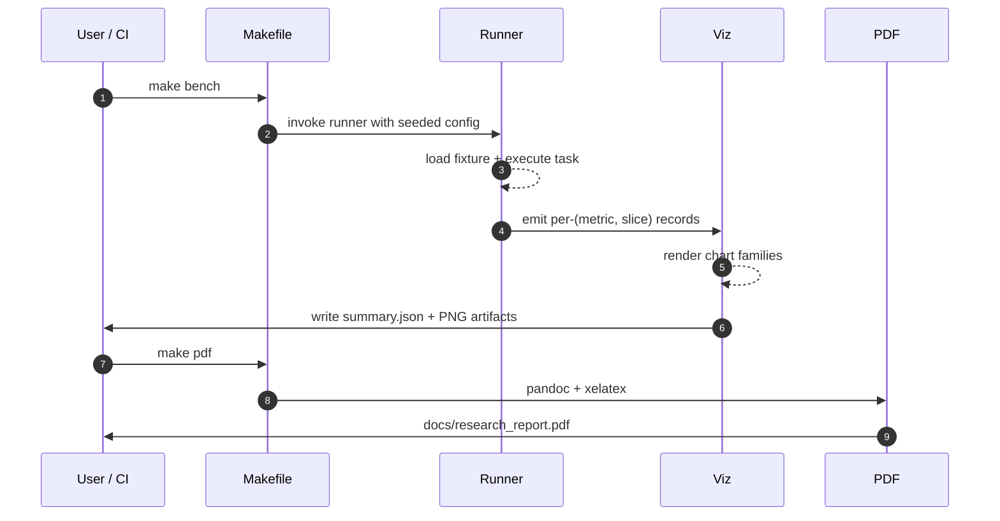

## 📚 Documentation & references

- **Research report (PDF):** [`docs/research_report.pdf`](./docs/research_report.pdf) — problem framing, methodology, full result tables, ablations, and tradeoffs.
- Key papers: FAISS *(Johnson et al. 2017)*, HNSW *(Malkov & Yashunin 2016)*, Product Quantization *(Jégou et al. 2011)*, ANN-Benchmarks *(Aumüller et al. 2017)*.

## 📄 License

Released under the [MIT License](./LICENSE).
