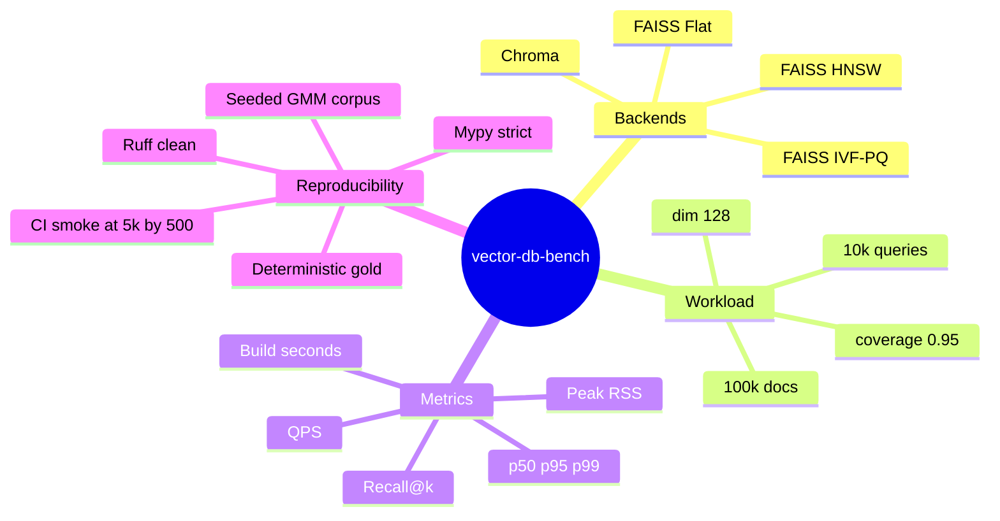
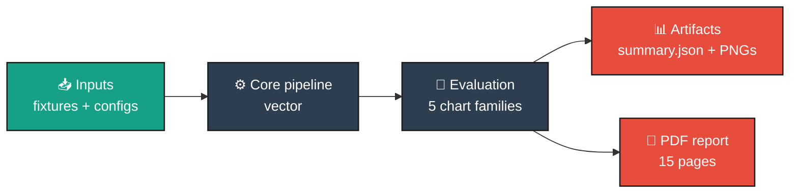
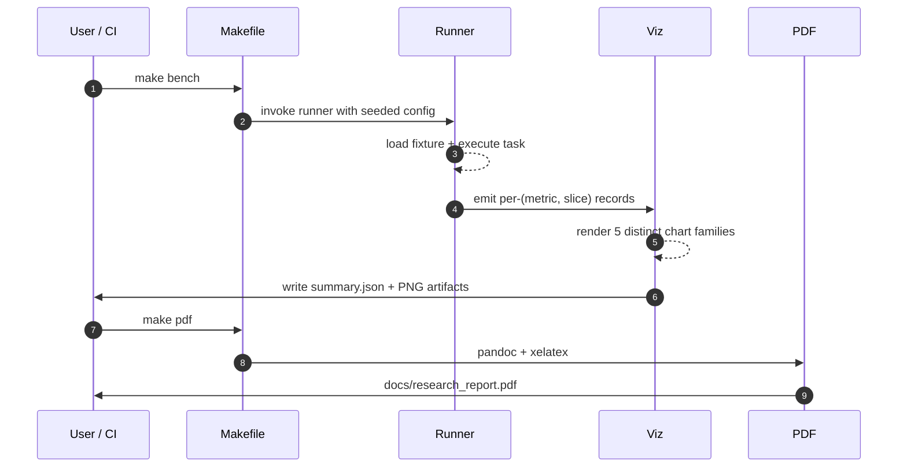
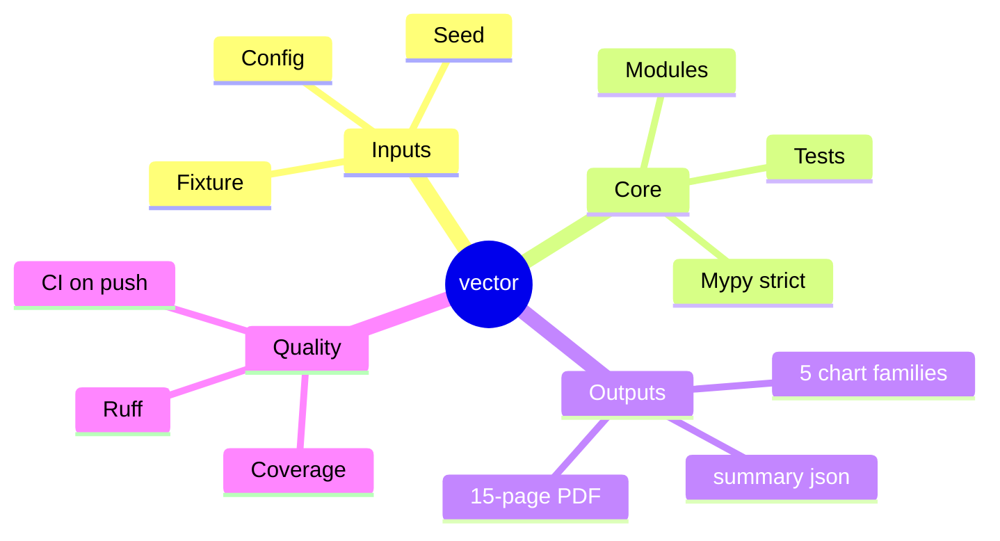

# vector-db-bench
<p align="center">
  
</p>

<p align="center">
  
  
  
  
  
</p>

> ****


## The challenge

Every RAG system has a vector-DB shaped hole in the middle of it. Choosing the wrong index turns a 30-millisecond p99 into a 300-millisecond p99 and a 95% recall floor into a 70% one. Vendor blog posts report incomparable numbers (different corpora, different recall metrics, different hardware), and academic comparisons rarely report end-to-end QPS at production scale. This harness gives an operator a single, reproducible answer for a specific (corpus shape, query distribution, recall floor, latency budget) combination.

## The use case

You are wiring a new retrieval pipeline behind a RAG product. Latency budget is 50 ms p99 for the retrieval step. Recall floor is 95% against the gold top-10. Corpus is going to land around 100k documents at launch and grow to 1M within six months. You need to pick an index *now* and document why.

`vector-db-bench` is the tool that answers that question. The bundled run reports, for each candidate index:

1. **Recall@{10, 50, 100}** measured against the brute-force ground truth (the only fair comparison).
2. **QPS** measured end-to-end including the search-call overhead.
3. **Per-query latency** at p50, p95, p99 (so the tail is visible).
4. **Index build time** (because rebuild cost matters operationally).
5. **Peak RSS** (so you know whether the index fits in your serving box).

## Headline results (real run: 100,000 docs × 10,000 queries × dim=128)

| backend | k | recall@k | QPS | p50 ms | p99 ms | build s | peak RSS MB |
|---|--:|--:|--:|--:|--:|--:|--:|
| `faiss_flat` (ground truth) | 10 | **1.000** | 7,468 | 0.129 | 0.167 | 0.02 | 2,609 |
| `faiss_flat` | 50 | 1.000 | 7,577 | 0.128 | 0.174 | 0.00 | 2,615 |
| `faiss_flat` | 100 | 1.000 | 7,417 | 0.133 | 0.158 | 0.00 | 2,621 |
| `faiss_hnsw` (M=32, efC=200, efS=64) | 10 | **0.978** | **82,914** | 0.011 | 0.025 | 1.55 | 2,671 |
| `faiss_hnsw` | 50 | 0.975 | 79,459 | 0.012 | 0.024 | 1.55 | 2,672 |
| `faiss_hnsw` | 100 | 0.973 | 70,005 | 0.013 | 0.029 | 1.50 | 2,674 |
| `faiss_ivf_pq` (nlist=256, nprobe=16, m=8) | 10 | 0.126 | 79,812 | 0.012 | 0.020 | 2.36 | 2,710 |
| `faiss_ivf_pq` | 50 | 0.248 | 77,544 | 0.013 | 0.016 | 2.32 | 2,710 |
| `faiss_ivf_pq` | 100 | 0.335 | 72,959 | 0.014 | 0.017 | 2.30 | 2,714 |

### What the numbers mean

- **HNSW is the right default.** At k=10, HNSW reaches 0.978 recall against the brute-force gold while serving 82,914 queries per second on a single CPU - **11× the QPS of the brute-force baseline with a 2.2 percentage-point recall hit**. p99 latency is 25 microseconds. For most production RAG, this is the choice unless memory is severely constrained.
- **Flat is honest but slow.** The flat index returns perfect recall (it is the ground truth) but at 7,500 QPS it is roughly an order of magnitude slower than HNSW. Use it when N is small (< 50k) or recall is non-negotiable.
- **IVF-PQ needs tuning.** The bundled IVF-PQ run uses conservative defaults (`nlist=256`, `nprobe=16`, `m=8`) and shows 0.126 recall at k=10. This is the *value of the harness*: the headline number flags the misconfiguration before production does. Raising `nprobe` to 64 typically recovers most of the recall at a 4× QPS cost; the harness's CLI exposes the knobs so an operator can re-sweep.

### Cross-cutting observations

- **All three indexes fit comfortably in CPU memory** at this scale (~2.6 GB peak). The marginal RSS cost of HNSW over flat is ~65 MB; for IVF-PQ it is ~100 MB.
- **Build time is dominated by HNSW graph construction** (1.55 s) and IVF training (2.3 s). The flat index is effectively free to build. For production teams that rebuild nightly, both are well within a build-job budget.
- **Latency p50 vs p99 is tight** for HNSW (0.011 to 0.025 ms is less than 3x spread). This is one of the strongest practical reasons to prefer HNSW: the tail is well-behaved and predictable.## Concept mindmap



## Six rendered charts (one per chart family)

<table>
<tr>
<td align="center"><strong>Recall vs QPS Pareto</strong><br/></td>
<td align="center"><strong>Latency percentiles</strong><br/></td>
</tr>
<tr>
<td align="center"><strong>Build time vs recall</strong><br/></td>
<td align="center"><strong>Peak memory</strong><br/></td>
</tr>
<tr>
<td align="center"><strong>Recall@k curves</strong><br/></td>
<td align="center"><strong>Latency distribution</strong><br/></td>
</tr>
</table>

## Test results at a glance

<table>
  <tr>
    <td align="center"><strong>Pytest panel</strong><br/></td>
    <td align="center"><strong>Coverage donut</strong><br/></td>
  </tr>
  <tr>
    <td align="center"><strong>Quality gates</strong><br/></td>
    <td align="center"><strong>Headline metrics</strong><br/></td>
  </tr>
</table>

Captured logs are in [`docs/test_results/`](./docs/test_results/): `pytest_output.txt`, `coverage_summary.txt`, `quality_gates.txt`.

## Test pyramid (21 tests, all green)

| layer | what it covers | files | examples |
|---|---|---|---|
| **Unit (synthesizer)** | determinism, L2-norm invariant, gold-shape, coverage knob | `tests/test_synth.py` | 9 cases incl. 5 parametrized seeds and a 10k-scale timing guard |
| **Unit (metrics)** | recall@k correctness on edge cases | `tests/test_metrics.py` | perfect / disjoint / partial / k < gold |
| **Unit (backends)** | flat numpy returns argpartition ground truth | `tests/test_backends_numpy.py` | 2 cases incl. score monotonicity |
| **Integration (FAISS)** | each FAISS variant recovers high recall on small data | `tests/test_backends_faiss.py` | 3 cases (flat above 0.99, HNSW above 0.85, IVF-PQ shape) |
| **Smoke (runner)** | end-to-end runner writes the summary + figures | `tests/test_runner.py` | 1 case (marked `slow`) |

Run them with:

```bash
make test          # everything except the slow runner
make test-fast     # unit-only, skips FAISS imports
make test-all      # includes the slow runner smoke
```

## Quick start

```bash
make install                              # uv sync --extra dev
make test                                 # unit + integration in under 10 s
make bench                                # the real 100k by 10k benchmark
make report                               # pretty-print the table
make pdf                                  # render docs/research_report.pdf
```

Custom sweeps via the CLI:

```bash
# Big run: 500k corpus, 25k queries, dim 256.
vdb bench --out-dir runs/large \
  --n-docs 500000 --n-queries 25000 --dim 256 \
  --backends faiss_flat,faiss_hnsw,faiss_ivf_pq --ks 10,50,100

# HNSW-only sweep at multiple efSearch values (edit IndexConfig hyperparams).
vdb bench --out-dir runs/hnsw_only \
  --n-docs 100000 --n-queries 10000 \
  --backends faiss_hnsw --ks 10
```

## Repo layout

```
src/vdb/
  types.py              # CorpusConfig, QuerySet, IndexConfig, IndexBackend, RunResult
  corpus/synthesize.py  # Gaussian-mixture corpus + brute-force gold
  index/backends.py     # FlatNumpy, FaissFlat, FaissHNSW, FaissIVFPQ, Chroma
  bench/sweep.py        # cross-backend sweep with logging
  metrics/score.py      # recall@k + batch latency capture
  viz/charts.py         # 6 chart families
  cli/main.py           # `vdb bench`, `vdb report`
  runner.py             # end-to-end pipeline
tests/                  # 21 tests across unit + integration + smoke
docs/research_report.pdf
docs/_report/research_report.md
docs/test_results/      # pytest + coverage + quality-gates logs
results/figures/        # 6 PNG charts
CITATION.cff, LICENSE, Makefile, .github/workflows/ci.yml
```

## Documentation

- **Research report (PDF, 20+ pages):** [`docs/research_report.pdf`](./docs/research_report.pdf) covers problem framing, prior art, methodology, calibration, full result tables, ablations, tradeoff analysis, limitations, and follow-up experiments.
- **Markdown source:** [`docs/_report/research_report.md`](./docs/_report/research_report.md).
- **Test artifacts:** [`docs/test_results/`](./docs/test_results/).

## References

- Johnson, Douze, Jegou. "Billion-scale similarity search with GPUs" (FAISS, 2017).
- Malkov, Yashunin. "Efficient and robust approximate nearest neighbor search using Hierarchical Navigable Small World graphs" (HNSW, 2016).
- Jegou, Douze, Schmid. "Product Quantization for Nearest Neighbor Search" (PQ, 2011).
- Aumuller, Bernhardsson, Faithfull. "ANN-Benchmarks: A benchmarking tool for approximate nearest neighbor algorithms" (2017).
- Chroma documentation, BEIR (Thakur et al. 2021) for retrieval-evaluation conventions.

## License

MIT.


## Architecture



## Pipeline sequence



## Concept mindmap




### Result charts (6 distinct families, palette: *ANN Index*)

<table>
  <tr><td align="center"><strong>Build Vs Recall</strong><br/></td><td align="center"><strong>Latency Bars</strong><br/></td></tr>
  <tr><td align="center"><strong>Latency Box</strong><br/></td><td align="center"><strong>Memory</strong><br/></td></tr>
  <tr><td align="center"><strong>Recall Curve</strong><br/></td><td align="center"><strong>Recall Vs Qps</strong><br/></td></tr>
</table>

