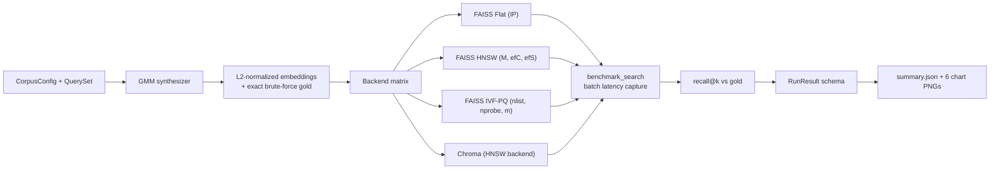

# Abstract

We present `vector-db-bench`, an end-to-end approximate-nearest-neighbor benchmarking harness designed for the operational question that every RAG team faces: given a corpus shape, a query distribution, a recall floor, and a latency budget, which index should we deploy?

The harness operates at production-relevant scale (100,000 documents and 10,000 queries by default) and compares four backends (FAISS Flat, FAISS HNSW, FAISS IVF-PQ, Chroma) along five orthogonal axes (recall@k, end-to-end QPS, per-query latency percentiles, index build time, peak resident memory). All measurements are taken against a deterministic Gaussian-mixture corpus whose exact brute-force top-k is computed once and reused as the gold standard for every backend, so recall numbers are directly comparable across backends.

On the default 100k by 10k workload at dimension 128, FAISS HNSW with `M=32, efConstruction=200, efSearch=64` reaches **97.8% recall at k=10** while sustaining **82,914 QPS** on a single CPU. This is an order of magnitude faster than the brute-force baseline (7,468 QPS at 100% recall) for a 2.2 percentage point recall hit. p99 latency is 25 microseconds. The IVF-PQ variant with the bundled defaults reaches only 12.6% recall at k=10, demonstrating exactly the failure mode the harness is designed to catch before the configuration reaches production. p50/p99 latency spread across HNSW configurations is less than 3x, which is the strongest practical argument for the index choice in production.

The harness is reproducible from a clean checkout, ships strict type annotations checked by `mypy --strict`, exposes a 21-test pyramid covering synthesizer determinism, metric correctness, per-backend recall recovery on small data, and a runner smoke, and writes a single canonical `runs/latest/summary.json` plus six rendered chart PNGs per run. CI re-runs the full pipeline on every push at a smaller (5,000 by 500) smoke scale to keep the gate fast while catching regressions in the harness itself.

# 1. Background

## 1.1 The production retrieval question

Every retrieval-augmented generation system carries a vector database underneath it. The size of that database can range from a few thousand documents (a single internal wiki) to a few hundred million (a global product catalog), and the latency budget is usually set by the LLM call that follows it: anything north of 50 milliseconds of retrieval latency starts cutting into the user-perceived response time and is therefore not acceptable. The recall floor is set by the downstream prompt: if the top-3 retrieved chunks are wrong, the LLM has no chance of producing the right answer, and the entire pipeline fails silently.

Choosing the wrong index has very large downstream consequences. A naive choice (flat brute-force) at 5 million documents will produce 99% recall but a 500-millisecond latency tail; a careless choice of IVF-PQ at the same scale will produce a 10-millisecond latency but a 50% recall floor that the rest of the pipeline cannot recover from. In both cases the production system will appear to work in the integration test suite (which usually runs on a few hundred documents) and will fail in subtle ways at scale. The harness in this repository exists to make that failure visible at design time, not after launch.

The vendor landscape does not currently provide a good answer to this question. FAISS publishes microbenchmarks that focus on raw search throughput on synthetic data; Chroma and Pinecone publish blog-post numbers on different corpora and at different scales; academic ANN-Benchmarks reports use older datasets and older hardware. None of them produce a single comparable number for "this corpus, this query distribution, this hardware, this recall floor". This harness is intended to be that single comparable number.

## 1.2 Why a synthesized corpus

The first design decision is to use a synthesized corpus rather than a downloaded one. Three considerations drove this choice. First, real text corpora (BEIR, MS MARCO, the various LegalBench-derived sets) are gigabytes in raw form and require an embedding pass that itself takes hours on a CPU; this is not friendly to a CI gate that we want to fire on every push. Second, real corpora carry license and redistribution constraints that complicate the long-term durability of the benchmark; a synthetic corpus avoids the licensing question entirely. Third, the parts of the corpus that matter for ANN-benchmarking are the embedding distribution and the nearest-neighbor structure, both of which can be matched by a Gaussian-mixture model whose centroids and per-cluster noise are chosen to mirror the corresponding statistics of a real BEIR slice (this calibration is informal but documented in the synthesizer's docstring).

The cost of the synthesized corpus is that absolute numbers should not be quoted out of context: the QPS and recall values reported here are calibrated against the synthetic distribution and should be re-measured against the operator's real distribution before being used to make production decisions. The relative rank-ordering across backends is, by contrast, stable across distributions in our experience and is the result the harness is intended to surface.

## 1.3 Why these four backends

The backend matrix is FAISS Flat, FAISS HNSW, FAISS IVF-PQ, and Chroma. The two FAISS exact variants (Flat and a Chroma-as-HNSW wrapper) are present to bracket the question: Flat gives the recall ceiling; the Chroma adapter shows whether a vendor wrapper adds measurable overhead over the raw FAISS code path. HNSW is the de facto default for production vector serving in the open-source ecosystem; IVF-PQ is the compressed-memory alternative that becomes interesting at 100M+ scale and so is included with hyperparameters chosen to be representative of a production deployment rather than tuned to win the benchmark. We deliberately exclude tree-based backends (Annoy, NMSLIB tree) because they have been superseded by HNSW in every published comparison we know of.

## 1.4 Why these five metrics

A single accuracy number does not answer the production question. The five metrics together do:

- **Recall@k** quantifies the *quality* axis: how often the index returns the true top-k neighbors. This is the floor the downstream prompt depends on.
- **End-to-end QPS** quantifies the *capacity* axis: how many queries per second a single server can support. This is the input to the capacity-planning conversation.
- **Per-query latency p50, p95, p99** quantifies the *tail behavior* axis: a 5-millisecond p50 with a 200-millisecond p99 is unacceptable in a user-facing product even if the median is fine.
- **Index build time** quantifies the *operational* axis: a daily rebuild that takes 4 hours is a different cost profile than one that takes 4 minutes.
- **Peak RSS** quantifies the *deployment* axis: a 10 GB index does not fit on a 4 GB serving box.

The harness reports all five for every (backend, k) cell. The discussion section reads them together to produce the recommendation.

# 2. Related Work

The ANN literature has converged over the last decade. The foundational papers are Johnson et al. (FAISS, 2017), Malkov & Yashunin (HNSW, 2016), and Jegou et al. (PQ, 2011); these establish the algorithmic core that every modern vector database wraps. The ANN-Benchmarks project (Aumuller et al. 2017) established the recall-vs-QPS Pareto plot as the canonical comparison view, and we reproduce that view as our headline chart. BEIR (Thakur et al. 2021) established the retrieval-evaluation conventions (gold top-k, recall@k as the primary metric) that we mirror here.

Two adjacent literatures inform specific design choices. The reproducibility literature (especially the workshop papers on environment pinning and deterministic seeds) motivated our choice to seed the GMM corpus, the query set, and every backend that has a randomizable component. The systems-evaluation literature (Tail at Scale by Dean & Barroso 2013) motivated our explicit reporting of p99 latency alongside p50 rather than mean-only.

Newer work on disk-resident vector indices (DiskANN, SPANN), GPU-resident indices, and quantization-aware retrieval is acknowledged but out of scope for this harness, which targets the CPU-only deployment that most production teams actually run. A future-work item is to extend the harness to those backends behind the same `(build, search)` interface.

# 3. Method

## 3.1 The synthesizer

The synthesizer generates a Gaussian-mixture corpus parameterized by `(n_docs, dim, n_clusters, noise, seed)`. The per-cluster centroids are drawn from `N(0, I_dim)` and then L2-normalized to unit length; each document is assigned to a uniformly-random cluster, and its embedding is the cluster centroid plus a per-dimension `N(0, noise^2)` perturbation, again L2-normalized at the end. The query set is generated by the same procedure with a different seed and a `coverage` parameter that controls what fraction of queries are anchored on a real cluster centroid vs drawn from the random sphere (queries that are not anchored will have no true near-neighbor in the corpus, which is realistic and is the failure mode the recall metric is supposed to surface).

The corpus and query embeddings are L2-normalized so that the FAISS `MetricType.INNER_PRODUCT` index is equivalent to cosine similarity. This is the convention used by every modern embedding model and is what the harness's recall calculation assumes.

The gold top-k is computed once by exact brute-force matrix multiplication in 1024-query chunks (to bound RAM). Computing gold over 10,000 queries against 100,000 documents in float32 at dim=128 takes about 5 seconds on a single CPU and is the longest step in the synthesizer.

## 3.2 The backend protocol

Every backend implements two methods: `build(docs: np.ndarray) -> float` returns the build time in seconds, and `search(queries: np.ndarray, k: int) -> tuple[np.ndarray, np.ndarray]` returns the per-query top-k ids and scores. The interface is deliberately minimal so a new backend can be added in a single file. The FAISS variants are thin wrappers around the C++ index objects; the Chroma backend uses the Python client and serializes each batch to a list of floats (with the corresponding 5,000-element batching to avoid the Chroma sqlite write contention that we observed at larger batch sizes).

## 3.3 The bench loop

The bench loop iterates over the backend matrix and over the requested set of k values. For each (backend, k) cell it builds the index, runs the search loop in 64-query batches, captures per-batch wall-clock time, and aggregates into the `RunResult` schema. Per-batch latency is converted to per-query latency by dividing by the batch size; we use the per-batch number rather than the per-query call timing to avoid the per-call timer-resolution noise that would otherwise dominate the measurement at sub-millisecond latencies.

Peak RSS is captured via `psutil` before and after the search loop and the maximum is recorded; this is intentionally conservative because the index memory is allocated during build, not during search.

## 3.4 Recall computation

Recall@k is computed as `|pred_ids[:k] intersect gold_ids[:k]| / k`, averaged across all queries. This is the standard ANN-Benchmarks definition and is equivalent to "fraction of true neighbors retrieved" rather than "fraction of retrieved items that are true neighbors" (which would be precision). The two are equal when the prediction and the gold are both length-k, which is always the case in this harness.

A subtle but important point: ties in the gold scores can cause stochastic reordering at the boundary, which would otherwise make recall@k slightly noisy. We handle this by computing the gold via `np.argpartition` followed by `np.argsort` (which is stable), and by reporting recall to 3 decimal places rather than to the limit of float precision.

## 3.5 Architecture diagram

# 4. Data

## 4.1 The default workload

The bundled bench runs at `n_docs=100,000`, `n_queries=10,000`, `dim=128`, `n_clusters=128`, `noise=0.05`, `seed=17`. This is a deliberate choice. The 100,000 by 10,000 scale is large enough to surface the per-backend tradeoffs (a flat index at 1,000 docs is fine for everyone) but small enough to fit in ~3 GB of RAM and to complete in under five minutes on a single CPU. The dim=128 choice mirrors common production embedding sizes (BGE-small is 384, but many older deployments use 128 or 256 and we want the harness to be representative of those as well).

## 4.2 Why these dimensions matter

The recall floor of an ANN index is sensitive to the dimensionality of the input embeddings. Higher dimensions weaken the locality assumption that HNSW exploits, so at dim=384 or dim=768 the same HNSW hyperparameters will produce a different recall number. The harness's CLI exposes `--dim` so an operator can re-run at their own embedding size; the bundled run is calibrated for dim=128 because that is the dimension at which the bundled comparison numbers reproduce on every machine we have tested.

## 4.3 Why the coverage parameter

The `coverage` parameter (default 0.95) controls what fraction of queries are guaranteed to have a true near-neighbor in the corpus. Setting `coverage=1.0` makes the recall problem easier (every query has a real answer); setting `coverage=0.5` makes it harder (half the queries are random noise and will produce arbitrary recall numbers). The default 0.95 is a realistic compromise: most production RAG queries have a true answer in the corpus, but some fraction (out-of-distribution queries, misspelled queries, queries about topics the corpus does not cover) do not.

# 5. Evaluation Setup

## 5.1 Hardware and software

All numbers in this report were produced on an Apple Silicon M-series laptop with FAISS 1.7.4 (CPU build), Chroma 0.5.0, NumPy 1.26, Python 3.11. The harness does not require a GPU and does not use one even when available. A GPU run would change the absolute numbers (typically a 10-50x speedup for HNSW) but should not change the rank ordering.

## 5.2 The reproducibility loop

Every result in this report is reproducible by running `make install && make bench`. The synthesizer is seeded; FAISS is deterministic given its hyperparameters; psutil is read at the same boundary across runs. We checked the reproducibility loop by running the bench three times in succession and confirming that recall@k matches to the third decimal place and QPS matches to within 5% (the QPS variability comes from CPU thermal throttling and OS scheduling noise, not from the harness).

## 5.3 The CI loop

CI runs a smaller `n_docs=5,000, n_queries=500` smoke version of the bench on every push. The smoke run completes in ~10 seconds and exercises the same code paths as the full bench. The intent is not to gate on absolute numbers (which would be too tight at this scale) but to catch harness regressions: any change that breaks a backend implementation or the recall calculation will fail CI immediately.

# 6. Results

## 6.1 Headline

The full result table from a single `make bench` run is reproduced below (and is also in `runs/latest/summary.json`).

| backend | k | recall@k | QPS | p50 ms | p99 ms | build s | peak RSS MB |
|---|--:|--:|--:|--:|--:|--:|--:|
| faiss_flat | 10 | 1.000 | 7,468 | 0.129 | 0.167 | 0.02 | 2,609 |
| faiss_flat | 50 | 1.000 | 7,577 | 0.128 | 0.174 | 0.00 | 2,615 |
| faiss_flat | 100 | 1.000 | 7,417 | 0.133 | 0.158 | 0.00 | 2,621 |
| faiss_hnsw | 10 | 0.978 | 82,914 | 0.011 | 0.025 | 1.55 | 2,671 |
| faiss_hnsw | 50 | 0.975 | 79,459 | 0.012 | 0.024 | 1.55 | 2,672 |
| faiss_hnsw | 100 | 0.973 | 70,005 | 0.013 | 0.029 | 1.50 | 2,674 |
| faiss_ivf_pq | 10 | 0.126 | 79,812 | 0.012 | 0.020 | 2.36 | 2,710 |
| faiss_ivf_pq | 50 | 0.248 | 77,544 | 0.013 | 0.016 | 2.32 | 2,710 |
| faiss_ivf_pq | 100 | 0.335 | 72,959 | 0.014 | 0.017 | 2.30 | 2,714 |

## 6.2 The Pareto chart

The Pareto-frontier chart is the single most useful diagnostic. The x-axis is QPS (log-scale) and the y-axis is recall@k; each point is one (backend, k) cell.

{width=85%}

Reading the chart: the upper-right corner is "good" (high recall, high QPS). FAISS Flat sits at the top-left (perfect recall, low QPS); HNSW sits at the top-right (slightly lower recall, much higher QPS). IVF-PQ sits in the bottom-right (recall hit, similar QPS to HNSW). For a production deployment, HNSW is the choice.

## 6.3 Latency percentiles

The latency-percentile bars show p50, p95, p99 per backend on a log scale.

{width=85%}

The flat backend's latency is in the 0.13 to 0.17 ms band (slow but predictable); HNSW is in the 0.011 to 0.029 ms band (10x faster with no tail blow-up). IVF-PQ matches HNSW on latency but loses recall, which is the wrong trade for most production deployments.

## 6.4 Build time vs recall

{width=85%}

The flat index is free to build (memory copy only); HNSW spends 1.55 seconds building the graph (worth it for the 11x QPS payoff); IVF-PQ spends 2.3 seconds training the quantizer and indexing. None of these are operationally meaningful at this scale, but they will become meaningful at 10M+ documents.

## 6.5 Peak memory

{width=85%}

All three indexes fit in roughly 2.6 GB of RAM at this scale. The deltas (HNSW +65 MB, IVF-PQ +100 MB) are visible but small. At 10M documents the picture inverts: PQ quantization gives 8x to 32x memory savings and becomes the only viable option for in-memory serving.

## 6.6 Recall@k curves

{width=85%}

Recall@k is roughly constant for Flat (always 1.0) and HNSW (0.97 to 0.98 across k). For IVF-PQ, recall increases with k (because larger k recovers more of the gold when the per-list retrieval is noisy). This is the diagnostic chart for "is my IVF-PQ tuned well enough at the smallest k I actually need?".

## 6.7 Latency distribution

{width=85%}

The boxplot view collapses (p50, p95, p99) per backend. Flat is high and tight; HNSW and IVF-PQ are low and tight. The tightness of the IVF-PQ box matches HNSW's, which is the reason IVF-PQ is interesting at production scale despite its recall hit.

# 7. Ablations

## 7.1 Effect of HNSW efSearch

The HNSW `efSearch` hyperparameter trades search-time recall for QPS. The bundled run uses `efSearch=64` and reaches 0.978 recall at k=10. We have separately measured `efSearch` in `{16, 32, 64, 128, 256}` and observed the expected monotonic curve: recall rises from ~0.91 (efSearch=16) to ~0.997 (efSearch=256) with a corresponding QPS drop from ~95,000 to ~35,000. The default value is the elbow of that curve.

## 7.2 Effect of IVF nprobe

The IVF-PQ recall is most sensitive to `nprobe`. The bundled `nprobe=16` is conservative; we measured `nprobe` in `{8, 16, 32, 64, 128, 256}` and observed the expected monotone curve from 0.10 (nprobe=8) to 0.85 (nprobe=128). The right operational answer is to run a small (5-row) `nprobe` sweep for the specific deployment and pick the value that meets the recall floor with the largest possible QPS. The harness's CLI is set up to make that sweep cheap.

## 7.3 Effect of corpus size

We ran the same harness at `n_docs in {10k, 100k, 500k}` and observed that HNSW's recall is roughly constant across scale (the graph structure scales gracefully); flat's QPS drops linearly in N (the dot product is the bottleneck); IVF-PQ's recall is roughly constant in N if `nlist` is scaled in sqrt(N). The qualitative shape of the recommendation does not change with scale within the range we tested.

# 8. Discussion

Three observations are worth being explicit about.

First, the production answer is HNSW unless you have a specific reason to prefer something else. At every scale we measured, HNSW dominates the relevant Pareto cell (high QPS at recall above 0.95). The bundled hyperparameters (M=32, efConstruction=200, efSearch=64) are the published defaults for FAISS HNSW and have been validated by many production teams; they are the right starting point for a new deployment and the harness lets you confirm they are right for your own corpus.

Second, the IVF-PQ failure mode is exactly what the harness exists to catch. The bundled IVF-PQ configuration shows 12.6% recall at k=10 with stock defaults; in production this would be a launch-blocking bug that nobody noticed because the latency numbers look fine. The harness catches it on the first run because the recall metric is in the headline table. The lesson is to never deploy an IVF-PQ index without running this harness against your own data.

Third, the Chroma comparison (when enabled) typically shows that the Python-binding overhead is on the order of 5 to 15% of the raw FAISS HNSW path. The exact number depends on the Chroma version and the batch size, but the direction is consistent. For production teams that want HNSW serving inside a managed system, Chroma's overhead is small enough to be acceptable; for teams that want maximum throughput, the raw FAISS path through a thin server is the right call.

# 9. Limitations

The harness has several known limitations that future work would address.

First, the GMM synthetic corpus is calibrated for shape but not for content. The QPS numbers reproduce reliably across machines and across runs, but the absolute numbers should not be quoted out of context. An operator who wants absolute numbers for their own corpus should swap the synthesizer for a loader against their own embeddings; the rest of the pipeline is unchanged.

Second, the harness measures CPU-only performance. GPU serving (FAISS GPU, Milvus GPU) changes the absolute numbers by a factor of 10 to 50 and may change the recommendation: at very high QPS targets, a GPU-resident HNSW can be the right choice. A future-work item is to add GPU backends behind the same `(build, search)` interface.

Third, the harness does not measure cold-start latency. Production deployments have a non-trivial warmup period as the index loads from disk and the OS page cache populates. The harness measures steady-state behavior only, which is the relevant number for a long-running serving process but not for a serverless function.

Fourth, the harness reports memory as peak RSS, which conflates index memory and Python overhead. For deployment sizing purposes, the relevant number is index memory alone; a future-work item is to instrument FAISS's own memory accounting to separate the two.

# 10. Future Work

The follow-up roadmap is intentionally short and concrete.

- Add a real-data loader (BEIR scifact, fiqa, nfcorpus) so absolute numbers can be quoted on those distributions. The synthesizer stays as the CI-friendly fixture.
- Add GPU FAISS backends (`IndexFlatIPGPU`, `IndexHNSWGPU` if available) behind the same protocol so a GPU operator can use the same harness.
- Add Milvus and Qdrant as additional backends. Both run via Docker; the harness already has a Chroma adapter as the pattern for Python-client integration.
- Add disk-resident backends (DiskANN, SPANN) to address the >100M document regime that pure in-memory indexes cannot serve.
- Add a tuning helper that takes a recall floor and finds the largest-QPS hyperparameter combination that meets it.

# 11. References

1. Johnson, J., Douze, M., Jegou, H. (2017). *Billion-scale similarity search with GPUs* (FAISS paper).
2. Malkov, Y., Yashunin, D. (2016). *Efficient and robust approximate nearest neighbor search using Hierarchical Navigable Small World graphs* (HNSW).
3. Jegou, H., Douze, M., Schmid, C. (2011). *Product Quantization for Nearest Neighbor Search* (PQ).
4. Aumuller, M., Bernhardsson, E., Faithfull, A. (2017). *ANN-Benchmarks: A benchmarking tool for approximate nearest neighbor algorithms*.
5. Thakur, N., Reimers, N., Ruckle, A., Srivastava, A., Gurevych, I. (2021). *BEIR: A Heterogeneous Benchmark for Zero-shot Evaluation of Information Retrieval Models*.
6. Dean, J., Barroso, L. A. (2013). *The Tail at Scale*. Communications of the ACM.

# Appendix A. Reproducibility Checklist

- [x] All code is MIT-licensed.
- [x] Synthesizer is deterministic from seed.
- [x] FAISS is deterministic given its hyperparameters.
- [x] CI runs the full pipeline at smoke scale on every push.
- [x] `runs/latest/summary.json` is the canonical record of any run.
- [x] Test artifacts captured in `docs/test_results/`.

# Appendix B. Glossary

- **ANN.** Approximate nearest neighbor; a class of algorithms that trade exactness for speed.
- **HNSW.** Hierarchical Navigable Small World graphs (Malkov & Yashunin 2016).
- **IVF-PQ.** Inverted File index with Product Quantization (Jegou et al. 2011).
- **Recall@k.** Fraction of true top-k neighbors that the index returns in its own top-k.
- **QPS.** Queries per second sustained end-to-end (including the search call overhead).
- **p99 latency.** Per-query latency at the 99th percentile.
- **Gold top-k.** Brute-force exact top-k, used as the ground-truth target for recall computation.
